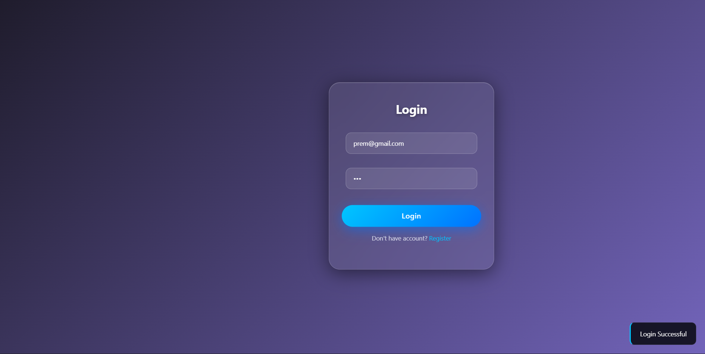
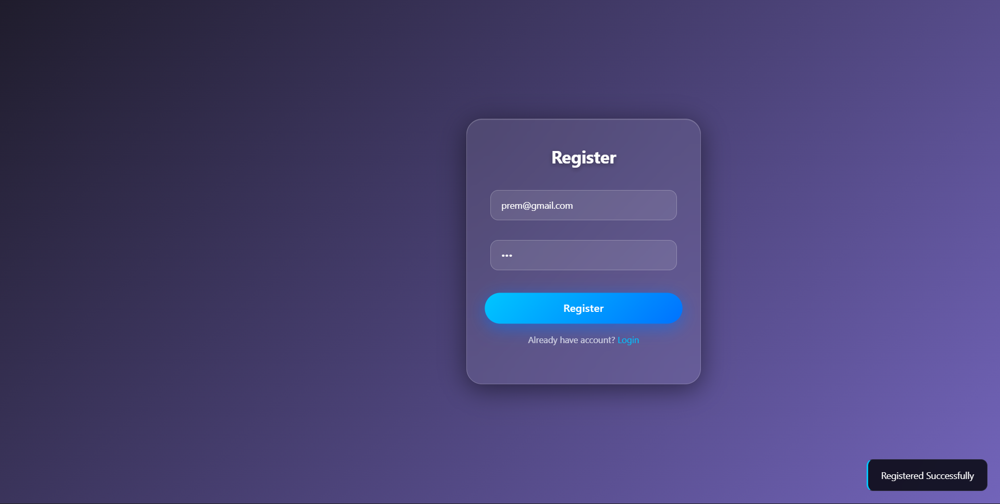
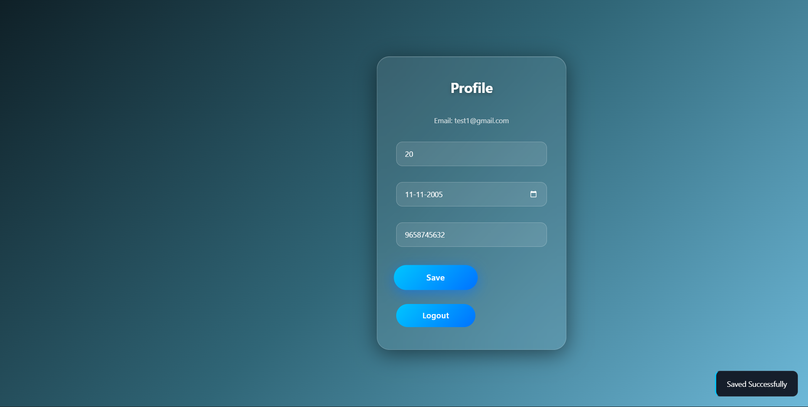

# GUVI Full Stack Internship Project

## 📌 Project Overview
This is a full stack web application developed as part of GUVI requirements.

The project includes:
- User Registration & Login (MySQL)
- Profile Management (MongoDB)
- Session Handling (localStorage + Redis)

---

##  Features

###  Authentication System
- Secure user registration and login
- Only valid Gmail addresses are accepted
- Invalid login attempts are rejected

---

###  Profile Management
- Users can store:
  - Age
  - Date of Birth
  - Contact Number
- Data is stored in MongoDB

---

###  Real-Time Popup Messages
- Instant feedback for:
  - Login success/failure
  - Registration success
  - Validation errors
- Smooth user interaction using JavaScript

---

###  Smooth UI & Animations
- Clean and modern UI design
- Smooth transitions and user-friendly experience

---

###  Mobile Responsive Design
- Built using Bootstrap
- Fully responsive across:
  - Mobile
  - Desktop

---

##  Validations Implemented

###  Email Validation
- Only valid Gmail format allowed  
 Example: user@gmail.com  
 Invalid: user@gmail, user@, user123  

---

###  Login Validation
- Only registered users can login  
- Invalid credentials are rejected  

---

###  Age Validation
- Age must be greater than 0  
 Zero or negative values not allowed  

---

###  Contact Validation
- Must be exactly 10 digits  
 Letters are not allowed  
 Less or more than 10 digits not allowed  

---

###  Required Fields
- All fields must be filled  
- Empty inputs are not accepted  

---

##  Technologies Used

- HTML, CSS, JavaScript  
- Bootstrap (Responsive UI)  
- jQuery (DOM manipulation & AJAX)  
- PHP (Backend)  
- MySQL (User authentication)  
- MongoDB (Profile storage)  
- Redis (Session storage)  

---

##  How to Run the Project

1. Start XAMPP (Apache & MySQL)
2. Place the project inside:
   C:\xampp\htdocs\guvi-project
3. Open browser:
   http://localhost/guvi-project/

---

## 📸 Screenshots

###  Login Page

---

###  Register Page

---

###  Profile Page

---

##  Notes for Reviewer

- AJAX is used for backend communication (no form submission)
- MySQL uses Prepared Statements
- Session is handled using:
  - localStorage (frontend)
  - Redis (backend)
- Project follows all GUVI guidelines

---

##  Author

**Prem Hari S**  
Maatram Foundation Student